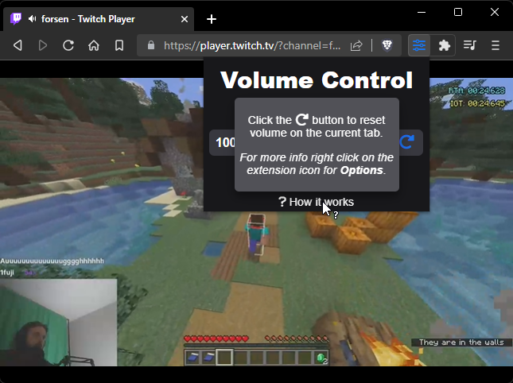

  
  <h1><b>Volume Control</b></h1>

Volume Control allows you to set different volume levels per tab in chrome. The volume levels are mapped exponentially this means 50 is a gain of 0.25, 100 is a gain of 1, and 200 is a gain of 4. It remembers preveously selected volume levels for each domain and use those when loading up the page again.

## Screenshots

  
  
  

## Compatibility

The add-on requires the [tabCapture API](https://developer.chrome.com/extensions/tabCapture) and therefore it only works on Google Chrome or Chromium-based browsers (e.g. Brave, Edge, Opera).

# Install
## Download: [**HERE**](https://github.com/yungsamd17/Twitch-Addons/releases)👈

Here is a short guide how to install an unpacked extension on Google Chrome or Chromium-based browsers (e.g. Brave, Edge, Opera).

1. Unzip the folder.

2. Place the folder somewhere you might not remove it by mistake.

3. Open the `Extensions` page `chrome://extensions/` in the browser and turn on the `Developer mode`.

4. Click on the `Load unpacked` button and select the directory where the extension is placed.

5. Done, Enjoy.

## Credits

Forked from [RedKenrok/Browser-TabVolume](https://github.com/RedKenrok/Browser-TabVolume)

## License

[ISC license](https://github.com/RedKenrok/Browser-TabVolume/blob/master/LICENSE)