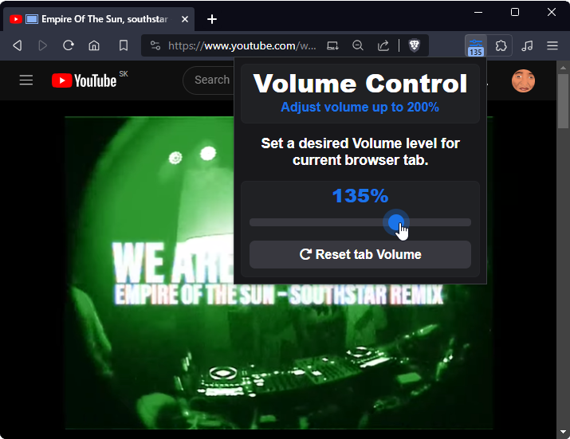

#  Volume Control

**Volume Control** allows you to set volume levels per tab in Chrome. You can boost volume is up to **200%** and you adjust it by **5%** per step on range slider. It remembers preveously selected volume levels for each domain and use those when loading up the page again.

## [**Download**](https://github.com/yungsamd17/Volume-Control/releases/latest/download/Volume-Control.zip)

### How to Install
Here is a short guide how to install an unpacked extension on **Google Chrome or Chromium-based browsers** (*e.g. Brave, Edge, Opera*).

1. Unzip the folder.
2. Place the folder somewhere you might not remove it by mistake.
3. Open the `Extensions` page `chrome://extensions/` in the browser and turn on the `Developer mode`.

4. Click on the `Load unpacked` button and select the directory where the extension is placed.
5. Done, Enjoy.

### Credits

Forked from [RedKenrok/Browser-TabVolume](https://github.com/RedKenrok/Browser-TabVolume)
